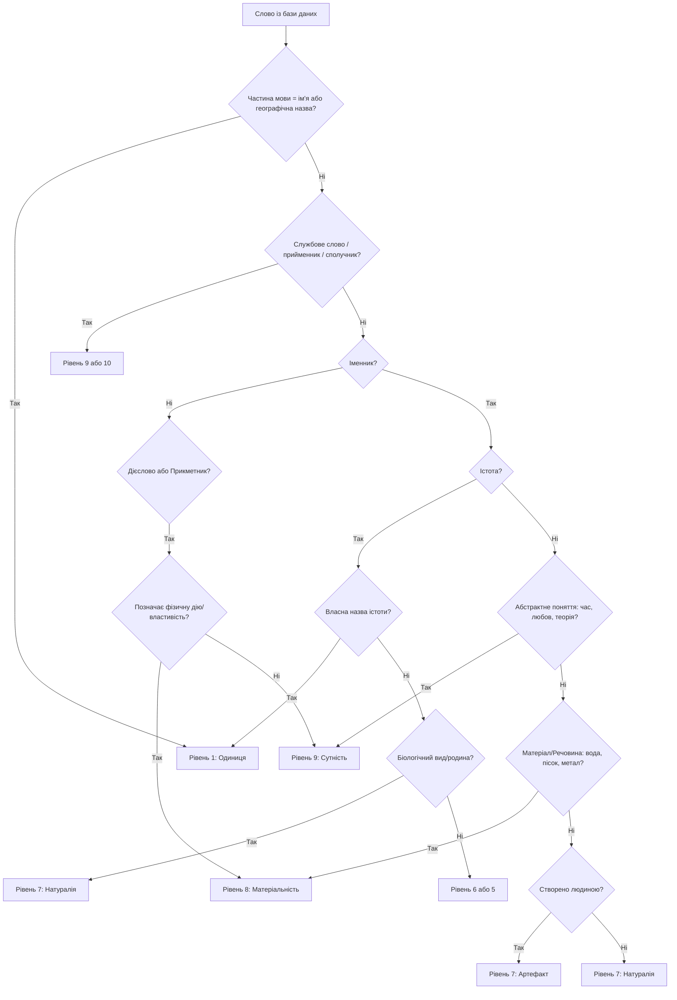

# Інструкція з класифікації рівнів абстракції слів для бази даних Word

Цей документ містить методологію класифікації слів за 10 рівнями абстракції (від Абсолюту до Одиниці) та специфікацію для майбутнього скрипта, який автоматично обробить SQL-дамп бази даних `Word.v.10.sql`, створить нову колонку `abstraction_level` та проставить відповідні значення для кожного слова.

---

## 1. Онтологічне питання: куди віднести «цифрові об'єкти»?

**Рішення:** Цифрові об'єкти (файли, сайти, коди, бази даних) доцільно **залишити на Рівні 7 (Артефакти)**, проте з уточненням концепту **Рівня 8 (Матеріальність)**.

### Обґрунтування:
1. **Збереження лінійної ієрархії («матрьошки»):** Якщо створювати окремий рівень для цифрових об'єктів, це порушить логічну вкладеність. Цифровий об'єкт не є надмножиною фізичного тіла, і навпаки.
2. **Фізична прив'язка (Інформаційна матеріальність):** Цифровий об'єкт не існує «у повітрі». Він завжди записаний на фізичному носії (заряди в транзисторах флешки, магнітні домени HDD, доріжки оптичного диска) і споживає реальну енергію. Таким чином, цифровий файл — це специфічний **стан матеріального тіла** (Рівень 8), змінений людиною з певною метою (Рівень 7, Артефакт).
3. **Функціональна схожість:** Для людської мови та мислення «файл», «документ» чи «програма» функціонують точно так само, як і фізичні артефакти: ми їх створюємо, зберігаємо, використовуємо та знищуємо.

Тому цифровий об'єкт класифікується як **Інформаційний артефакт** на **Рівні 7**.

---

## 2. 10 Рівнів абстракції для слів (Класифікаційна шкала)

| № | Назва рівня | Опис для класифікації слів | Приклади слів (укр.) |
|---|---|---|---|
| **10** | **Абсолют (Буття)** | Найзагальніші категорії існування, граматичні зв'язки найвищого порядку, частки заперечення чи ствердження всього існування. | *буття, всесвіт, космос, усе, ніщо, абсолют, є, існувати* |
| **9** | **Сутність (Концепт)** | Абстрактні ідеї, граматичні класи, службові слова, займенники загального типу, математичні та логічні поняття. | *кохання, час, простір, число, ідея, думка, він, щось, оскільки, хоча, теорія* |
| **8** | **Матеріальність (Тіло)** | Слова, що позначають фізичну матерію, речовини, енергію або загальні поняття фізичних тіл без прив'язки до їхнього походження чи призначення. | *матерія, речовина, тіло, вода, газ, метал, камінь, світло, атом, об'єкт* |
| **7** | **Походження (Генезис)** | Поділ на природне (біологічне/геологічне) та створене людиною (рукотворне). | *артефакт, природа, організм, тварина, рослина, виріб, предмет, інструмент* |
| **6** | **Призначення (Роль)** | Загальні функціональні класи речей, які обслуговують сфери людського життя. | *транспорт, меблі, одяг, їжа, будівля, посуд, зброя, житло* |
| **5** | **Категорія (Кластер)** | Конкретні предметні групи всередині функціональних класів. | *стілець, стіл, куртка, черевик, тарілка, автомобіль, літак, будинок* |
| **4** | **Рід (Гіперонім)** | Загальний клас конкретного предмета. | *письмовий (стіл), кухонний (стіл), легковий (автомобіль), зимова (куртка)* |
| **3** | **Вид (Гіпонім)** | Специфічний різновид предмета чи вузькоспеціалізоване слово. | *парта, секретер, позашляховик, парка, пуховик* |
| **2** | **Модель (Варіація)** | Власні назви моделей, серій, брендів або слова з гранично конкретними характеристиками. | *Бекрант (модель IKEA), Corolla, iPhone, Nike* |
| **1** | **Одиниця (Індивід)** | Унікальні об'єкти в реальному світі. Власні назви людей, конкретних міст, планет, а також вказівні займенники найнижчого рівня. | *Київ, Сонце, Шевченко, Петро, це, отой (вказівка на конкретний предмет)* |

---

## 3. Правила класифікації за частинами мови

Майбутній скрипт повинен використовувати поле `part_of_language` з таблиці `word` для первинного розбору:

1. **Власні імена (`чоловіче ім`я`, `жіноче ім`я`):**
   * Автоматично отримують **Рівень 1 (Одиниця)**.
2. **Службові частини мови (`сполучник`, `прийменник`, `частка`, `вигук`, `вставне слово`):**
   * Зазвичай отримують **Рівень 9 (Сутність)** або **Рівень 10 (Абсолют)**, оскільки вони не позначають матеріальних об'єктів, а лише зв'язки між поняттями.
3. **Займенники (`займенник`):**
   * Вказівні займенники (*це, цей, той*) -> **Рівень 1 (Одиниця)** або **Рівень 9** залежно від контексту (у словнику базово присвоювати **Рівень 9** як загальним концептам вказівки, або **Рівень 1** якщо це точкові індексали).
   * Особові (*я, ти, ми*) -> **Рівень 9**.
4. **Прислівники, дієприслівники (`прислівник`, `дієприслівник`):**
   * Отримують **Рівень 9** або **Рівень 8** (якщо описують фізичну дію чи матеріальну властивість, наприклад, *швидко*, *гаряче*).
5. **Дієслова (`дієслово`, `ініфінітив`):**
   * Фізичні процеси (*бігти, плавитися, копати*) -> **Рівень 8** (дія над матеріальним тілом).
   * Ментальні/абстрактні процеси (*думати, кохати, аналізувати*) -> **Рівень 9** (абстрактний концепт).
6. **Прикметники (`прикметник`, `дієприкметник`):**
   * Матеріальні властивості (*дерев'яний, залізний, круглий, важкий*) -> **Рівень 8**.
   * Суб'єктивні чи концептуальні властивості (*гарний, правильний, теоретичний*) -> **Рівень 9**.
7. **Іменники (`іменники`):**
   * Проходять повну класифікацію від 10 до 1 за допомогою семантичного аналізу (див. розділ 4).

---

## 4. Специфікація алгоритму класифікації для майбутнього скрипта

Майбутній Python-скрипт має виконувати такі кроки:

### Крок 1. Модифікація структури SQL-файлу
Скрипт повинен знайти опис таблиці `CREATE TABLE IF NOT EXISTS `word`` та додати нове поле:
```sql
`abstraction_level` tinyint(4) DEFAULT NULL COMMENT 'Рівень абстракції від 1 до 10'
```

### Крок 2. Парсинг INSERT-команд
Скрипт читає файл `Word.v.10.sql` рядок за рядком. Для кожного рядка `INSERT INTO `word` (...) VALUES (...)`:
1. Витягує значення полів: `word`, `part_of_language`, `creature`, `genus`, `number` тощо.
2. Пропускає слово через систему логічних правил (Heuristic Rules).
3. Якщо правила не дають чіткої відповіді, використовується зовнішній API (наприклад, OpenAI / Gemini API або локальна модель WordNet/LLM) для визначення рівня абстракції слова на основі наданих 10 рівнів.

### Крок 3. Алгоритм прийняття рішень (Heuristic Flowchart)



### Крок 4. Запит до LLM (якщо правила не спрацювали)
Для складних слів надсилається prompt до API:
> «Класифікуй українське слово "[СЛОВО]" (частина мови: [ЧАСТИНА МОВИ]) за шкалою абстракції від 1 до 10, де:
> 10 - Абсолют/Буття
> 9 - Сутність/Концепт
> 8 - Матеріальність/Тіло (речовини, матеріали)
> 7 - Походження (загальні артефакти або природні класи)
> 6 - Призначення/Роль (категорії побуту: транспорт, одяг)
> 5 - Категорія (стіл, машина)
> 4 - Рід (офісний стіл)
> 3 - Вид (секретер, парта)
> 2 - Модель (конкретний бренд/лінійка)
> 1 - Одиниця (унікальний предмет або ім'я).
> Відповідь надай виключно однією цифрою від 1 до 10.»

### Крок 5. Запис результату
Скрипт дописує отриману цифру в кінець списку значень кожного `VALUES` у SQL-файлі та зберігає оновлений файл.

---

## 5. Приклад обробленого рядка в SQL

**До обробки:**
```sql
INSERT INTO `word` (`id`, `word`, ..., `created_at`, `updated_at`) VALUES (581985, 'Євген', ..., '2017-04-30 15:05:27', '2017-05-01 23:35:06');
```

**Після обробки (з доданою колонкою `abstraction_level`):**
```sql
INSERT INTO `word` (`id`, `word`, ..., `abstraction_level`, `created_at`, `updated_at`) VALUES (581985, 'Євген', ..., 1, '2017-04-30 15:05:27', '2017-05-01 23:35:06');
```
*(Значення `1` проставлено автоматично, оскільки "Євген" — це чоловіче ім'я, тобто унікальний індивід).*
