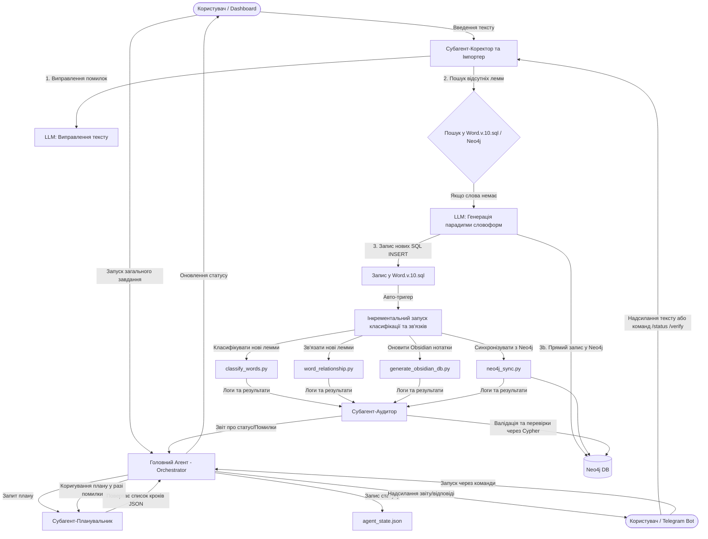

# План впровадження мультиагентної системи (Orchestrator, Planner, Auditor, Ingester, Neo4j, Telegram)

Цей план описує архітектуру, вибір технологічного стеку, стратегію збереження стану, інтеграцію графової бази даних Neo4j, підключення Telegram-бота та етапи розробки мультиагентної системи для керування процесом класифікації слів, побудови зв'язків, перевірки/додавання нових слів та генерації знань.

---

## 🛠️ Технологічний стек та збереження стану

1. **Базовий стек**: **Custom Async Agent Framework (Python + `asyncio`)**.
   - Агенти будуть реалізовані як легковажні Python-класи, інтегровані з існуючим `LLMRotator`.
   - Запуск довгих процесів (класифікація слів тощо) буде виконуватися через `subprocess` або прямий виклик функцій з асинхронним перехопленням логів для забезпечення безперебійної роботи Streamlit.
2. **Бази даних для збереження знань**:
   - **SQL-дамп (`Word.v.10.sql`)**: Текстовий персистентний дамп, що містить повну структуру.
   - **Obsidian Vault (`obsidian_words_db/`)**: Локальний набір Markdown-файлів для зручної візуалізації графу слів та їхнього ручного перегляду людиною.
   - **Графова база даних Neo4j**: Професійна СУБД для зберігання графу слів, миттєвого пошуку шляхів, ієрархічного аналізу та автоматичного аудиту зв'язків.
     - *Бібліотека*: `neo4j` (офіційний Python-драйвер).
3. **Канали інтерфейсу**:
   - **Streamlit Dashboard** (візуальне відображення стану агентів, підключення до Neo4j, ручне введення тексту).
   - **Telegram-бот**: Чат-бот для взаємодії з системою з будь-якого пристрою. Дозволяє надсилати тексти для перевірки/імпорту, отримувати статус роботи Orchestrator та звіти Аудитора.
     - *Бібліотека*: `pyTelegramBotAPI` (легковажна бібліотека `telebot`) або `aiogram`.
4. **Керування станом та стійкість (State & Persistence)**:
   - **Рівень оркестрації**: Файл `scratch/agent_state.json` зберігатиме поточну сесію, список кроків плану та статус кожного кроку (`pending`, `running`, `completed`, `failed`).
   - **Рівень даних**: Наявні файли кешу (`classification_cache.json`, `relationship_cache.json`) та база знань Neo4j.

---

## 📐 Модель даних у Neo4j

Слова та їхні граматичні зв'язки будуть представлені в Neo4j у вигляді графів:
- **Вузли**:
  - `(:Word)`: Вузол для кожного запису з бази даних.
    - Властивості: `id`, `word` (текст), `part_of_language`, `abstraction_level`, `genus`, `number`, `is_main_form`, `main_form_code` тощо.
- **Зв'язки (Relationships)**:
  - `(w1:Word)-[:CHILD_OF]->(w2:Word)`: Відображає логічну ієрархію рівнів абстракції (наприклад, `парта` -[:CHILD_OF]-> `стіл`). Відповідає полю `parent_id`.
  - `(inf:Word)-[:INFLECTION_OF]->(lemma:Word)`: Пов'язує граматичні форми слова (де `is_main_form = 0`) з його головною канонічною леммою (де `is_main_form = 1`).

---

## 📐 Архітектура агентів та автоматичний ланцюжок (Pipeline)

### 1. Головний Агент (Orchestrator)
- **Функція**: Керує виконанням плану, завантажує стан із `agent_state.json`, ініціює інкрементальні запуски після додавання нових слів через Dashboard або Telegram.

### 2. Субагент-Планувальник (Planner)
- **Функція**: Аналізує поточні файли та Neo4j (кількість вузлів, наявність незв'язаних слів) і генерує кроки виконання у JSON.

### 3. Субагент-Аудитор (Auditor)
- **Функція**: Перевіряє якість та правильність даних за допомогою Cypher-запитів в Neo4j (пошук циклів, сиріт та порушень ієрархії).

### 4. Субагент-Коректор та Імпортер (Ingester)
- **Функція**: Отримує текст (із Streamlit або Telegram), виправляє помилки за допомогою LLM, знаходить нові слова, генерує парадигми словоформ, вносить їх у SQL-файл, синхронізує з Neo4j та ініціює інкрементальний запуск обробки.

---

## 🤖 Робота з Telegram-ботом

Telegram-бот підключається за допомогою токена `TELEGRAM_BOT_TOKEN`, який буде зчитуватися з файлу `.env.local`. Він підтримує наступний функціонал:

### Команди бота:
- `/start` або `/help`: Вітальне повідомлення з переліком доступних функцій та описом роботи системи.
- `/status`: Запит поточного стану оркестратора (читання `agent_state.json`). Показує фазу виконання, загальну статистику бази та Neo4j.
- `/verify`: Запуск субагента-аудитора для негайної перевірки цілісності бази даних та надсилання звіту про помилки (наприклад, циклічні зв'язки).
- `/run`: Запуск повного циклу класифікації та зв'язування слів.
- `/stop`: Примусова зупинка активних процесів.

### Обробка тексту:
- Коли користувач надсилає будь-яке текстове повідомлення (без команд), бот розцінює це як текст для імпорту.
- Бот автоматично передає текст до `IngesterAgent`.
- Після завершення інкрементальної обробки бот надсилає звіт:
  - *«✅ Текст перевірено та виправлено: [Виправлений текст]»*
  - *«📝 Додано нових лемм: [список доданих слів]»*
  - *«⚙️ Рівні та зв'язки розраховано, нотатки в Obsidian створено!»*

---

## 📋 Запропоновані зміни та файлова структура

Буде створено нову підпапку з агентними модулями та оновлено дашборд:

### [NEW] `agents`
- `agents/base.py`: Базовий клас агента з інтеграцією `LLMRotator`.
- `agents/orchestrator.py`: Логіка Orchestrator, збереження та відновлення стану `agent_state.json`.
- `agents/planner.py`: Субагент-планувальник для генерації кроків.
- `agents/auditor.py`: Субагент-аудитор для перевірки результатів (включаючи Cypher-валідацію в Neo4j).
- `agents/spelling_ingester.py`: Субагент для обробки тексту, виправлення граматики, генерації парадигми словоформ, імпорту в SQL-файл та авто-запуску інкрементальної класифікації.
- `agents/neo4j_sync.py`: Субагент/скрипт для імпорту повної бази SQL у Neo4j та інкрементальної синхронізації нових слів.
- `agents/telegram_bot.py`: **[Новий]** Логіка Telegram-бота, обробка текстових повідомлень від користувача та запуск команд Orchestrator.

### [NEW] `run_agents.py`
- Консольний скрипт для запуска агентного пайплайну окремо від GUI (з підтримкою автоматичного відновлення після збоїв).

### [NEW] `run_telegram_bot.py`
- **[Новий]** Скрипт для запуску Telegram-бота в якості фонової служби.

### [MODIFY] `dashboard/app.py`
- Додавання вкладки `🤖 Агентне керування` з візуалізацією кроків.
- Додавання розділу «Імпорт та перевірка тексту» для обробки тексту.
- Додавання секції перевірки статусу підключення до Neo4j та відображення базової статистики графу.
- **[Нове]** Відображення статусу роботи Telegram-бота (чи активний процес `run_telegram_bot.py`).

---

## ⚖️ Узгоджені рішення та налаштування

1. **Обробка помилок**: Головний агент при виникненні будь-яких помилок зупиняє роботу (halt) та чекає на вказівки користувача через дашборд або Telegram.
2. **Обмеження словоформ**: Повна граматична парадигма словоформ генерується лише для змінних частин мови (іменники, прикметники, дієслова).
3. **Neo4j**: База знань Neo4j працює локально (з налаштуваннями bolt://localhost:7687 та логіном/паролем з `.env.local`). У майбутньому планується деплой на Hostinger у Docker-контейнер.
4. **Telegram-бот**: Токен бота `TELEGRAM_BOT_TOKEN` записується у локальний файл `.env.local`.
